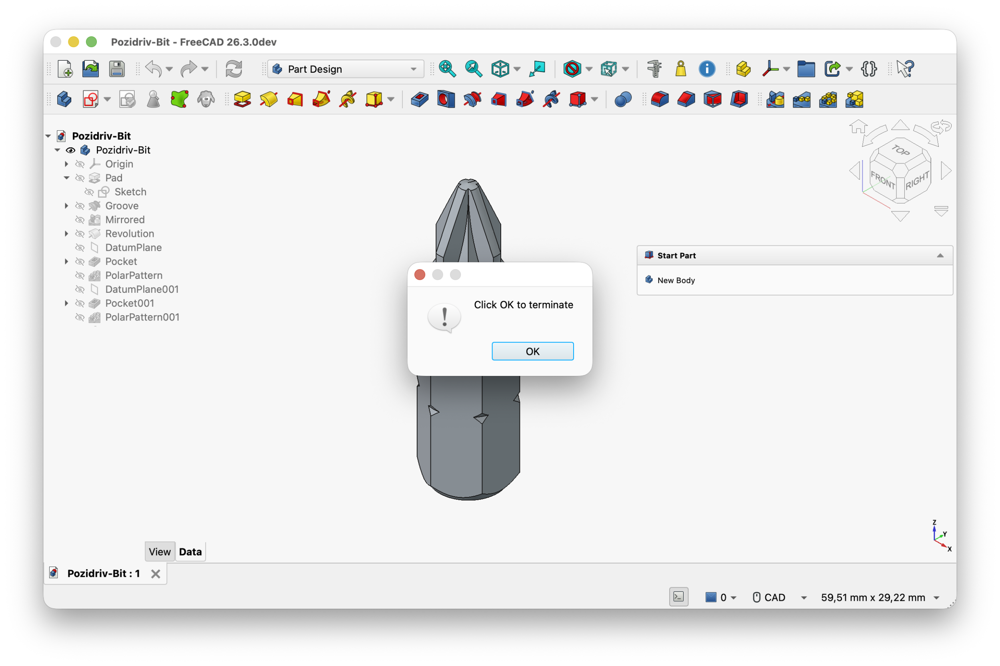

# Click OK to Terminate

A FreeCAD addon that recreates the notorious fatal-error dialog.

## Installation

Install **Click OK to Terminate** from the FreeCAD Addon Manager, then restart
FreeCAD. The button is added to FreeCAD's standard **View** toolbar.

## Usage

Click **Click OK to Terminate** in the View toolbar.

A `Runtime Exception` information dialog appears. Dismiss it with **OK** or its
close button to immediately close FreeCAD. Open documents are discarded without
a save prompt.

Unsaved data **will be lost**!

## License

Code is licensed under GPL-3.0-or-later. Assets are licensed under CC0-1.0; see
[LICENSE](LICENSE) and [LICENSE-Assets](LICENSE-Assets).
